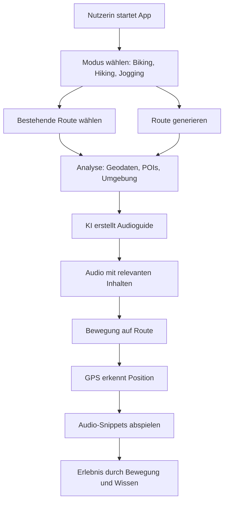
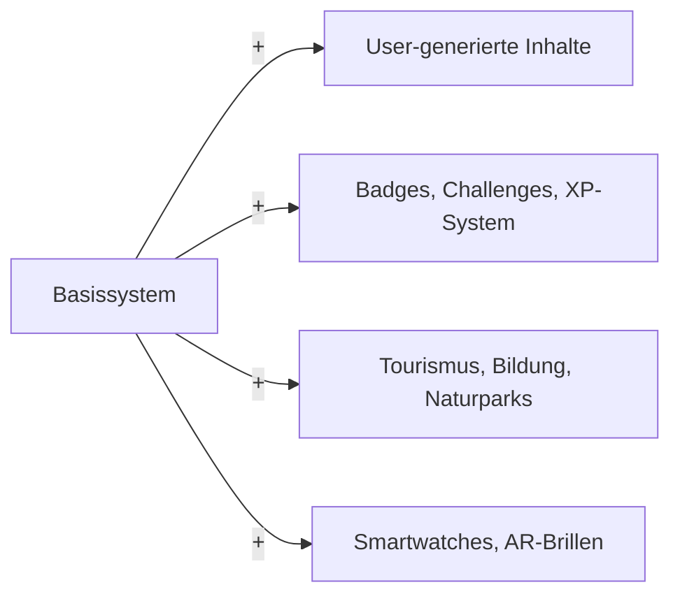

# 🎧 TrailTales – KI-gestützte Outdoor-Routen mit Audio-Erlebnis

## 🚀 Vision

**TrailTales** ist eine innovative, plattformübergreifende App für Outdoor-Enthusiast:innen, die körperliche Aktivität mit spannendem, standortbasiertem Wissen kombiniert. Unser Ziel ist es, Menschen ihre Umgebung auf neue Weise erleben zu lassen – durch smarte, kontextbewusste Audioguides entlang personalisierter Routen.

## ✨ Kernfunktionen

### 🔍 Routen-Generator & -Finder
- Individuelle Routen für **Biking**, **Hiking** und **Jogging**
- Basierend auf Nutzerpräferenzen: Distanz, Schwierigkeitsgrad, POIs

### 🎧 KI-generierte Audioguides
- Inhalte entlang der Route zu:
  - Historischen Orten
  - Flora & Fauna
  - Geologischen/geografischen Besonderheiten
  - Lokalen Mythen & Funfacts

### 🧠 Personalisierung & Kontext
- Standort- und bewegungsabhängige Inhalte (via GPS)
- Individuelle Audioausgabe je nach Bewegungstyp
- Anpassung an Interessen, Uhrzeit, Wetter und mehr

---

## 🎤 Pitch

> **„Wir bringen dir nicht nur den Weg – wir bringen dir die Geschichte, die Natur und das Unsichtbare entlang deiner Route.“**

Ob Stadtlauf, Radtour oder Bergwanderung – unsere App verwandelt jede Route in ein kleines Abenteuer. Statt stummer Kartenansichten liefert TrailTales lebendige Audioguides, die zum richtigen Zeitpunkt das Richtige erzählen. Für wissensdurstige Entdecker:innen mit Bewegungslust.

👉 Route finden oder generieren
👉 Loslaufen. Kopfhörer auf. Zuhören. Staunen.
👉 Jede Bewegung wird zum Erlebnis.

---

## 🔁 Funktionsweise

## 🧱 Skalierbarkeit & Erweiterungen

## 🧰 Technologien & Tools

### 🔧 T3 Stack
- **Next.js** – SSR, Routing, API-Routen
- **TypeScript** – Typsicher & skalierbar
- **Tailwind CSS** – UI-Styling
- **tRPC** – API-Kommunikation ohne Boilerplate
- **Prisma** – ORM für Datenbankanbindung
- **NextAuth.js** – Authentifizierung

---

### 🗺️ Karten, GPS & Geodaten
- **Mapbox**, **Leaflet.js** oder **OpenStreetMap**
- **Geocoding APIs**: Mapbox, Google, OpenCage
- **Elevation APIs**: OpenTopoData
- **Turf.js** – Geodatenverarbeitung

---

### 🎧 Audio-Generierung
- **TTS APIs**:
  - OpenAI TTS
  - ElevenLabs
  - Google TTS
  - Amazon Polly
- **Audio-Streaming**:
  - Web Audio API
  - CDN (z. B. Cloudflare R2)

---

### 🤖 Künstliche Intelligenz
- **OpenAI API** – Wissensgenerierung (GPT)
- **LangChain / Vercel AI SDK** – für orchestrierte KI-Flows
- **Vektor-Datenbanken**:
  - Pinecone
  - Weaviate
  - Supabase Vector
- **Prompt-Vorlagen** – kontextabhängig nach POI-Kategorie

---

### 📍 Kontextuelle Funktionen
- **GPS-Ortung** via Web oder Mobile
- **Geofencing / Proximity Detection** zur Audio-Auslösung

---

### ☁️ Infrastruktur
- **Vercel** – Hosting & Serverless API
- **Planetscale / Supabase / Neon** – PostgreSQL-kompatibel
- **Cloudflare R2 / Amazon S3** – Audio-File-Storage
- **Cronjobs** – für dynamische oder saisonale Inhalte

---

### 📱 Optional: Native Erweiterung
- **React Native** oder **Expo**
- **Capacitor** – Web-to-Native-Bridge
- **Bluetooth-Integration** & **Smartwatch-Kompatibilität**

---

## 🧠 Dev-Tipps
- KI-Logik modular entwickeln (z. B. als Microservice mit eigener API)
- Inhalte früh strukturieren (POI-Kategorien, Tonalität, Dauer)
- Triggerzonen & Routenpunkte als **GeoJSON** speichern
- **Testen mit lokalen GPX-Dateien** oder simuliertem GPS

---

## 🏁 Nächste Schritte
- [ ] MVP mit statischen POIs + Audiogenerierung
- [ ] Echtzeit-GPS-Tracking & Triggerlogik
- [ ] Benutzerprofil + Favoriten / Routenhistorie
- [ ] TTS-Streaming-Integration
- [ ] Erste Beta-Tests & Feedback-Loop

---

## 📄 Lizenz & Mitwirkende
- **Lizenz**: MIT
- **Idee & Entwicklung**: *[Dein Name oder Teamname]*

---

> 💬 **Möchtest du zusätzlich erhalten?**
> - Eine Beispiel-`.env`-Datei
> - Setup-Anleitung (Installation, Start, Deployment)
> - Technisches Architekturdiagramm mit Code-Kommentaren?
> 👉 **Sag einfach Bescheid 😎**
